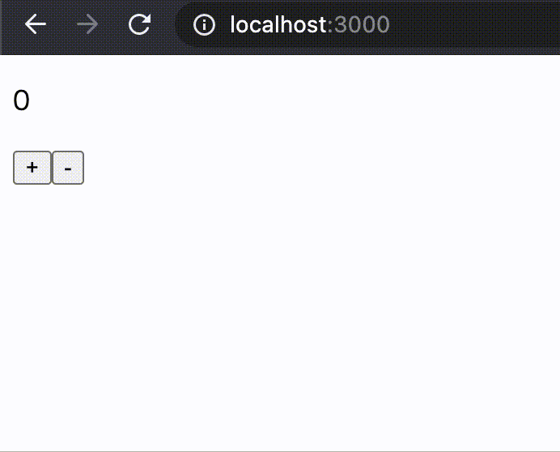
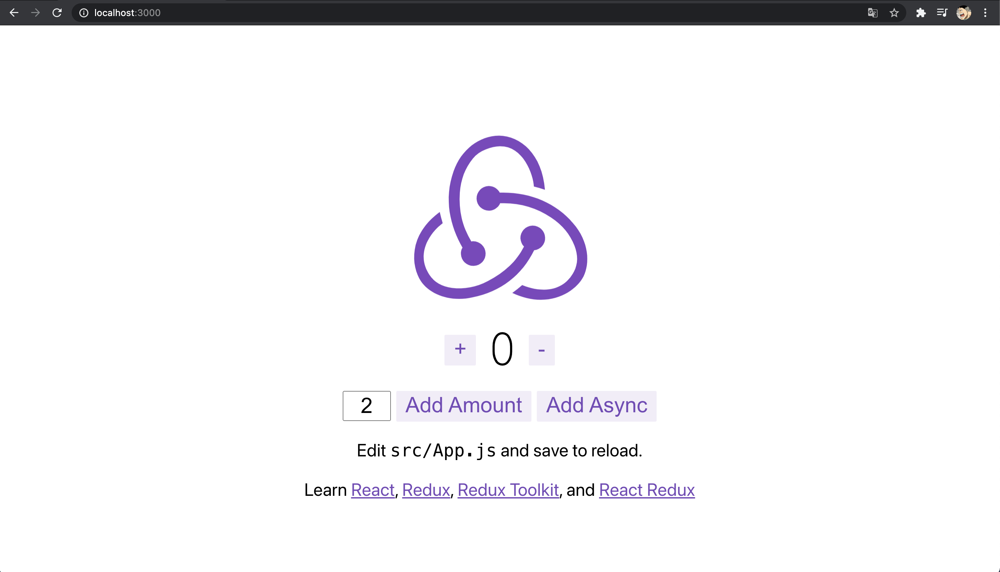

# react-counter

[](https://github.com/hironomiu/react-counter/actions?query=workflow%3Aaction)

React Hooks の導入、useState を counter(+文字入力)アプリで理解用のサンプルコード



## 環境

### 開発環境のバージョン

```
$ node -v
v14.15.1
$ npm -v
6.14.8
$ npx -v
6.14.8
$ yarn -v
1.22.5
```

### インストール

- バージョン管理
  - [参考：nodeenv-vs-nodenv-vs-nvm](https://www.npmtrends.com/nodeenv-vs-nodenv-vs-nvm)
  - [参考：nodebew](https://formulae.brew.sh/formula/nodebrew)(上記以外の Mac での選択肢)

## Chrome DevTools

動作の確認で利用。[React Developer Tools](https://chrome.google.com/webstore/detail/react-developer-tools/fmkadmapgofadopljbjfkapdkoienihi)プラグインを追加でインストール

## create-react-app

react-countup 用のベースアプリを作成

```
$ mkdir react-counter
$ cd react-counter
$ npx create-react-app .
```

## run server

`http://localhost:3000/`で countup App を起動

```
$ yarn start
```

## setup(delete file)

`×`のファイルは今回は不要なので削除

```
$ tree src
src
├── × App.css
├── App.js
├── App.test.js
├── × index.css
├── index.js
├── × logo.svg
├── × reportWebVitals.js
└── setupTests.js
```

## components setup

`component`毎に作成していくために`components`ディレクトリで管理する

```
$ cd src
$ mkdir components
```

## setup(modifi file)

` index.js``App.js `を以下に変更

`src/index.js`

```
import React from "react"
import ReactDOM from "react-dom"
import App from "./components/App"
ReactDOM.render(
  <React.StrictMode>
    <App />
  </React.StrictMode>,
  document.getElementById("root")
)
```

`src/App.js` -> `src/components/App.js`

```
import React from 'react'

const App = () =>{
  return (
    <>
      hello
    </>
  )
}

export default App
```

## counter App の実装

main レポの[src 配下](https://github.com/hironomiu/react-counter/tree/main/src)の内容を実装

## アプリケーションテスト

[src/App.test.js](https://github.com/hironomiu/react-counter/blob/main/src/App.test.js)を編集

- [JEST 公式：expect](https://jestjs.io/docs/ja/expect)

### package.json

```
+ "test": "react-scripts test --env=jsdom --verbose"
- "test": "react-scripts test"
```

### テストの実行

VSCode の場合[Jest](https://marketplace.visualstudio.com/items?itemName=Orta.vscode-jest)で行うことも可能

```
$ npm test
```

## GitHub Actions

開発のホームディレクトリに`.github/workflows`ディレクトリを作成し[action.yml](https://github.com/hironomiu/react-counter/blob/main/.github/workflows/action.yml)を配置

- [公式：GitHub Actions 入門](https://docs.github.com/ja/actions/learn-github-actions/introduction-to-github-actions)

## React Hooks ドキュメント

- [React 公式:hooks-state](https://ja.reactjs.org/docs/hooks-state.html)

## ツール

- [React Developer Tools](https://chrome.google.com/webstore/detail/react-developer-tools/fmkadmapgofadopljbjfkapdkoienihi)
- [React 公式(英語)](https://reactjs.org/docs/optimizing-performance.html#use-the-production-build)
- [React 公式(日本語)](https://ja.reactjs.org/docs/optimizing-performance.html#use-the-production-build)

## VSCode Extensions

VSCode でアプリケーションテスト含め開発する場合は以下の Extensions をインストール

- ES7 React/Redux/GraphQL/React-Native snippets
- Prettier - Code formatter
  - 設定 ->「Editor: Format On Save」をチェック
- [Jest](https://marketplace.visualstudio.com/items?itemName=Orta.vscode-jest)

## FYI

`template`に`redux`を指定すると counter アプリが標準で動作

```
$ mkdir hoge
$ cd  hoge
$ npx create-react-app . --template redux
$ yarn start
```


